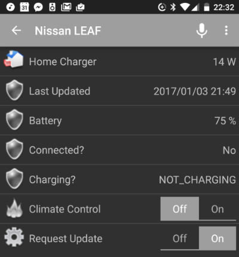

# leaf-python-mqtt

Hacked together script to extract data from Nissan Leaf API using [pycarwings2](https://github.com/jdhorne/pycarwings2) and post to MQTT. Once data is in MQTT it can easily be used to inform home automation and smart charging applications. e.g OpenHAB, Home Assistant, OpenEVSE.

Here is an example of displaying the MQTT data via openHAB Android app:



## Usage

### Status

Every XX min as defined in `config.ini` the following status(s) are updated to MQTT sub topics:

```
leaf/status/last_updated
leaf/status/battery_percent
leaf/status/charging_status
leaf/status/connected
```

The raw json output from Nissan API request is posted to MQTT topic:

`leaf/status/raw`

These scheduled 'status' updates are polled from the Nissan API and not requested from the car. I.e. the last car status is returned. See the 'Control' section below for how to request an update from the car. Requesting the latest status from the API does not effect the car, eg. GSM telematics in the car are not activated.

**It's not recommended to poll the Nissan API more fequently then about 10-15min, be a good citizen :-)**

### Control

By default the following control MQTT topics are used


`leaf/control/update`

Publishing `1` to the update control sub-topic will request and update from the car.

**Caution: this will activate the cars GSM telematic modem. Frequent poilling is not recomended as it could drain the cars 12V aux batttery**

`leaf/control/climate`

Publishing `1` to the `climate` control sub-topic will turn on the cars climate control. Publishing `0` will turn it off. *Currently there does not seem to be anyway to retrieve the status of the climate control from the pycarwings2 lib*

***

## Install Requirements

**Requires python 2.7.9 & python pip**

### Install carwings python lib

`pip install git+https://github.com/jdhorne/pycarwings2.git`

See [pycarwings2 repo](https://github.com/jdhorne/pycarwings2) for more info

### Install other python libs

`pip install schedule datetime paho-mqtt time`

*pip may require `sudo`*


## Install Leaf-python-mqtt

Clone this repo:

`$ git clone https://github.com/glynhudson/leaf-python-mqtt`

Create config file using default file as a template, edit config to suit requirements. You will need to enter your CarWings / NissanConnect EV username and password.

```
$ cd leaf-python-mqtt
$ cp default.config.ini config.ini
$ nano config.ini
```

The default config is setup for Nissan Leaf cars in Europe with region code `NE`, change the region code to one of the following if you are in a different region:  

```
NNA : USA
NE : Europe
NCI : Canada
NMA : Australia
NML : Japan
```

Test script by running

`$ ./leaf-python-mqtt.py`

## Run script as system service

### Create Systemd service

Create systemd service, assuming repo was cloned to `/home/pi` folder on a RaspberryPi, adjust paths if needed

`$ sudo ln -s /home/pi/leaf-python-mqtt/leaf-python-mqtt.service /etc/systemd/system/leaf-python-mqtt.service`

Set permissions:

`sudo chmod 644  /etc/systemd/system/leaf-python-mqtt.service`

Reload systemd then enable the service at startup:

```
$ sudo systemctl daemon-reload
$ sudo systemctl enable leaf-python-mqtt.service
$ sudo systemctl start leaf-python-mqtt.service
```

Check service status and view log snippet with:

`sudo systemctl status leaf-python-mqtt.service`

To view more lines of logs add `nXX` where XX is the number of lines e.g. to view 50 lines of logs

`sudo systemctl status leaf-python-mqtt.service -n50`

Start, stop and restart with:

```
sudo systemctl start leaf-python-mqtt.service
sudo systemctl stop leaf-python-mqtt.service
sudo systemctl restart leaf-python-mqtt.service
```
